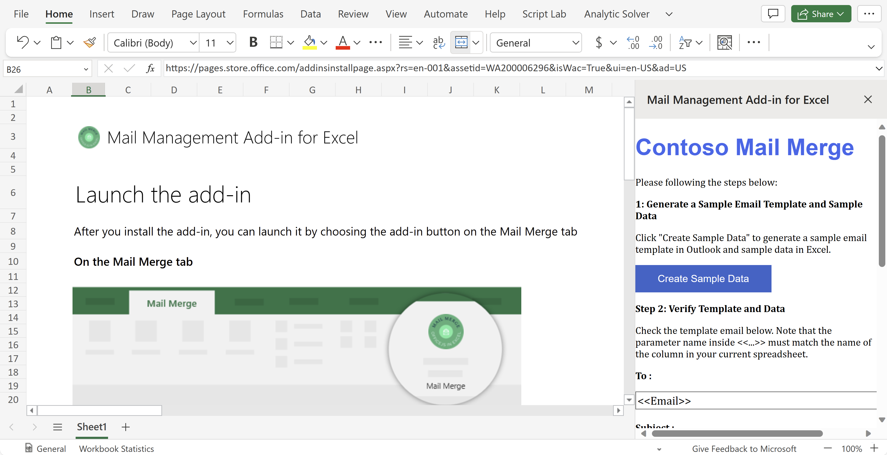
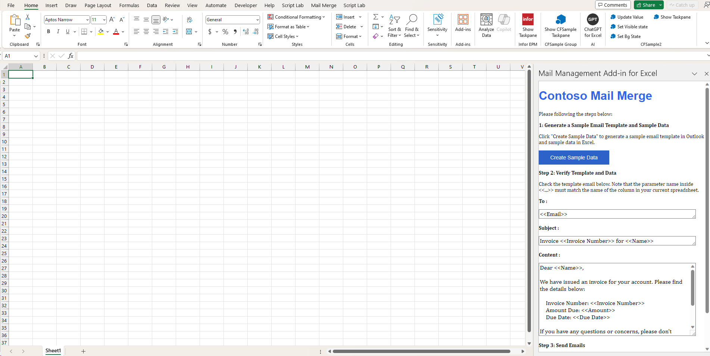
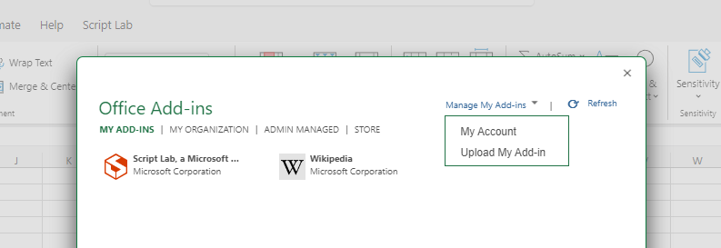
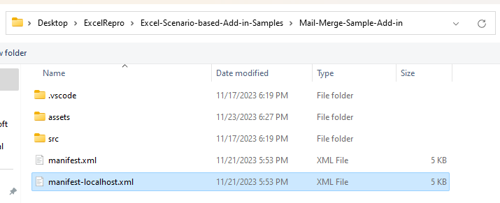

# Microsoft Excel Mail Merge Sample Office Add-in

[](https://github.com/microsoftgraph/msgraph-training-office-addin/actions/workflows/node.js.yml) 

This sample demonstrates how to use the Microsoft Graph JavaScript SDK to send emails in Excel from Office Add-ins.

## How the sample add-in works
### Features
- Create Sample Data, including valid email address (required) and other information.
- Verify Template and Data, the To Line must contain the column name of the email address.
- Send Email, which will pop up a dialog to get the consent of Microsoft Graph. After sign-in, the email will be send out.

### Play the sample add-in demo
Click the button below and play the sample add-in demo:<br><br>
<a href="https://office.live.com/start/Excel.aspx?culture=en-US&omextemplateclient=Excel&omexsessionid=c0a9c7a1-b954-45df-9295-8c1e21201f34&omexcampaignid=none&templateid=WA200006296&templatetitle=Mail%20Merge%20Add-in%20for%20Excel&omexsrctype=1" target="_blank"></a>
<br>

#### Note：
You need to have a Microsoft 365 account to try the sample. You can [sign up for the Microsoft 365 Developer Program](https://developer.microsoft.com/microsoft-365/dev-program) to get a free Microsoft 365 subscription.<br>

### Expected result
When you click the button, you will open Excel online in a new browser tab, and the sample add-in will launch automatically.



## Build, run and debug the sample code
### Prerequisites

To run the completed project in this folder, you need the following:
- Either a personal Microsoft account with a mailbox on Outlook.com, or a Microsoft work or school account. You can [sign up for the Microsoft 365 Developer Program](https://developer.microsoft.com/microsoft-365/dev-program) to get a free Microsoft 365 subscription.

### Run on your local machine
#### 1. To run the sample on desktop, please follow the steps provided below.

- Run command below in PowerShell for Windows
   ```
   iwr aka.ms/exceladdin/mail -outfile excelmail.bat; saps excelmail.bat
   ```
- For MacOS:
   ```
   bash <(curl -L -s aka.ms/exceladdin/mail_mac) 
   ```
This script works in Windows or MacOS, and it will automatically execute all the required steps for running the sample and opening the code for viewing and editing. The steps include:
- Install Node.js, npm, git if they are not found on your machine.
- Download sample project.
- Launch Visual Studio Code (or launch sample project directory if you don’t have VS Code installed).
- Run the sample automatically if you choose so.
  
Stay tuned for expanded platform support on this command.

#### 2. If you have a web application ID already, please ensure: 
    
In [Microsoft Entra admin center](https://aad.portal.azure.com) under **Identity > Applications > App registrations**: 
- Navigate to **Redirect URI**, set the first drop-down to `Single-page application (SPA)` and its value to `https://localhost:3000/consent.html`.

Otherwise, if you haven't registered a web application with the Azure Active Directory admin center, please follow the steps below:
* Log into [Microsoft Entra admin center](
https://aad.portal.azure.com) using a personal or business Microsoft account.
* In the navigation, select **Identity > Applications > App registrations**.
* Choose **New registration**. On the **App registrations** page, configure the values as follows: 
    - Set **Name** to `Office Add-in Graph Tutorial`.
    - Set **Supported account types** to **Accounts in any organizational directory and personal Microsoft accounts**.
    - Under **Redirect URI**, set the first drop-down to `Single-page application (SPA)` and set the value to `
https://localhost:3000/consent.html`.
* Click **Register** and copy the value of the **Application (client) ID**.

#### 3. In Visual Studio Code: edit the `taskpane.js` file and replace `YOUR_APP_ID_HERE` with the **Application Id** you got from the App Registration Portal. 

#### 4. Run the following command in your CLI to start the sample add-in on desktop.
```console
npm run start
```

### Expected result

A webpack server will be hosted on https://localhost:3000/, as the CLI shows:


An Excel desktop application will be auto-launched and the Mail Merge Addin will be auto-run on the right taskpane area. The sideload steps has been integrated into the process, eliminating the need for manual intervention.



Please follow the steps below:

1. Create Sample Data, including valid email address (required) and other information.

2. Verify Template and Data, the To Line must contain the column name of the email address.

3. Send Email, which will pop up a dialog to get the consent of Microsoft Graph. After sign-in, the email will be send out.

    

### Sideload the sample add-in on Excel Online

The previous steps show you how to run our sample on Desktop. As for the Excel Online, please follow the following steps to sideload the manifest.xml file on web.

1.  **Keep the webpack server on** to host your sample add-in.
1.  Open [Office on the web](https://office.live.com/).
1.  Choose **Excel**, and then open a new document.
1.  On the **Home** tab, in the **Add-ins** section, choose **Add-ins** and click **More Add-ins** on the lower-right corner to open Add-in Store Page.
1.  On the **Office Add-ins** dialog, select the **MY ADD-INS** tab, choose **Manage My Add-ins**, and then **Upload My Add-in**.

    

1.  Browse to the localhost add-in manifest file(manifest-localhost.xml), and then select **Upload**.

    

1.  Verify that the add-in loaded successfully. 

## Additional resources
You may explore additional resources at the following links:
- More samples: [Office Add-ins code samples](https://github.com/OfficeDev/Office-Add-in-samples)
- Office add-ins documentation: [Office Add-ins documentation](https://learn.microsoft.com/en-us/office/dev/add-ins/)

## Feedback
Did you experience any problems with the sample? [Create an issue]( https://github.com/OfficeDev/Word-Scenario-based-Add-in-Samples/issues/new) and we'll help you out.

## Copyright
Copyright (c) 2021 Microsoft Corporation. All rights reserved.
This project has adopted the [Microsoft Open Source Code of Conduct](https://opensource.microsoft.com/codeofconduct/). For more information, see the [Code of Conduct FAQ](https://opensource.microsoft.com/codeofconduct/faq/) or contact [opencode@microsoft.com](mailto:opencode@microsoft.com) with any additional questions or comments.
<br>**Note**: The taskpane.html file contains an image URL that tracks diagnostic data for this sample add-in. Please remove the image tag if you reuse this sample in your own code project.


## Disclaimer
**THIS CODE IS PROVIDED *AS IS* WITHOUT WARRANTY OF ANY KIND, EITHER EXPRESS OR IMPLIED, INCLUDING ANY IMPLIED WARRANTIES OF FITNESS FOR A PARTICULAR PURPOSE, MERCHANTABILITY, OR NON-INFRINGEMENT.**
